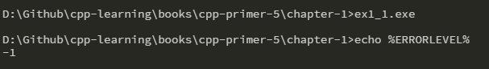
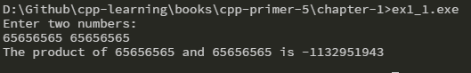
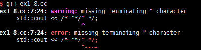
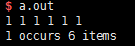
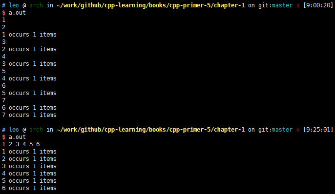
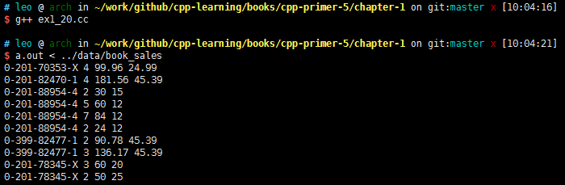
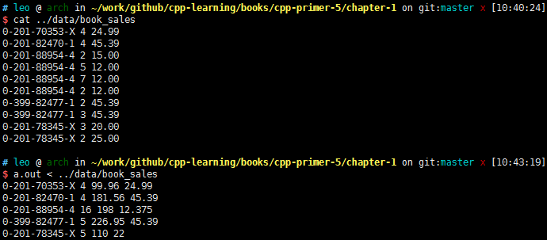
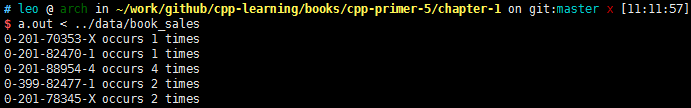

# 第一章  开始

## 练习 1.1  
> 查阅你使用的编译器的文档，确定它所使用的文件命名约定。编译并运行第2页的`main`程序。  

1. 文件命名约定  
* [GCC and File Extensions](http://labor-liber.org/en/gnu-linux/development/extensions)  
* [File Types Created for Visual C++ Projects](https://msdn.microsoft.com/en-us/library/3awe4781.aspx)  

2. 运行`main`程序  
* windows  
  

## 练习 1.2  
> 改写程序，让它返回-1,。返回值-1通常被当作程序错误的标识。重新编译并运行你的程序，观察你的系统如何处理`main`返回的错误标识。  

* Windows  
  

* Linux  
返回**255**，原因查看[这里](http://www.tldp.org/LDP/abs/html/exitcodes.html)。  

## 练习 1.3  
> 编写程序，在标准输出上打印`Hello, World`。  

```cpp
#include <iostream>

int main()
{
    std::cout << "Hello, World" << std::endl;
    return 0;
}
```

## 练习 1.4  
> 我们的程序使用加法运算符+来将两个数相加。编写程序使用乘法运算符*，来打印两个数的积。  

```cpp
#include <iostream>

int main()
{
    std::cout << "Enter two numbers: " << std::endl;
    int v1 = 0, v2 = 0;
    std::cin >> v1 >> v2;
    std::cout << "The product of " << v1 << " and " << v2
              << " is " << v1 * v2 << std::endl;
    return 0;
}
```
> 其实我们在使用乘法时，应该是所有数值操作是，特别要注意数值**越界**的情况  
  

## 练习 1.5
> 我们将所有输出操作放在一条很长的语句中。重写程序，将每个运算对象的打印操作放在一条独立语句中。  

```cpp
 #include <iostream>
 
int main()
{
    std::cout << "Enter two numbers: " << std::endl;
    int v1 = 0, v2 = 0;
    std::cin >> v1 >> v2;
    std::cout << "The sum of ";
    std::cout << v1;
    std::cout << " and ";
    std::cout << v2;
    std::cout << " is ";
    std::cout << v1 + v2;
    std::cout << std::endl; // Don't forget to add "endl" to flush content
}
```

注意最后的`std::endl`，这是一个被称为 **操作符（manipulator）** 的特殊值。写入`endl`的效果是结束当前行，并将于设备关联的缓冲区（buffer）中的内容刷到设备中。缓冲刷新操作可以保证到目前为止程序所产生的所有输出都真正写入输出流中，而不是仅仅停留在内容中等待写入流。  

## 练习 1.6
> 解释下面程序片段是否合法。  
> ```cpp
> std::cout << "The sum of " << v1;
>           << " and " << v2;
>           << " is " << v1 + v2 << std::endl;
> ```
> 如果程序是合法的，它输出什么？如果程序不合法，原因何在？应该如何修正？  

此程序不合法，在编译阶段会报出错误：  
```
error: expected primary-expression before ‘<<’ token
```
因为在程序没有结束之前有`;`，只需要移除第一行、第二行末尾的逗号就行。

## 练习 1.7
> 编译一个包含不正确的嵌套注释的程序，观察编译器返回的错误信息。

源码：
```cpp
#include <iostream>

/* This is a nested test
 * and this comment contains /* */
 */
int main()
{
    std::cout << "Enter two numbers: " << std::endl;
    int v1 = 0, v2 = 0;
    std::cin >> v1 >> v2;
    std::cout << "The sum of ";
    std::cout << v1;
    std::cout << " and ";
    std::cout << v2;
    std::cout << " is ";
    std::cout << v1 + v2;
    std::cout << std::endl; // Don't forget to add "endl" to flush content

}
```

编译之后错误是：   
```
ex1_5.cpp:5:3: error: expected unqualified-id before ‘/’ token
  */
   ^
```

## 练习 1.8
> 指出下列哪些输出语句是合法的（如果有的话）：  
> ```cpp
> std::cout << "/*";
> std::cout << "*/";
> std::cout << /* "*/" */;
> std::cout << /* "*/" /* "/*" */;
> ```
> 预测编译这些语句会产生什么样的结果，实际编译这些语句来验证你的答案（编写一个小程序，每次将上述一条语句作为其主体），改成每个编译错误。

编译之后的结果如下：  
  

修正，在第三条语句中的最后添加一个双引号，整个程序都可以运行：  
```cpp
std::cout << /* "*/" */";
std::cout << /* "*/" /* "/*" */;
```
打印出来结果：  
```cpp
/**/ */ /* 
```

## 练习 1.9
> 编写程序，使用`while`循环将50到100的整数相加。
```cpp
#include <iostream>

int main()
{
    int sum = 0, val = 50;

    while (val <= 100)
    {
        sum += val;
       ++val;
    }
    std::cout << "Sum of 50 to 100 inclusive is "
              << sum << std::endl;
   return 0;
}
```
结果：  
```cpp
Sum of 50 to 100 inclusive is 3825
```

## 练习 1.10
> 除了++运算符将运算对象的值增加1之外，还有一个递减运算符（--）实现将值减少1。编写程序，使用递减运算符在循环中按递减顺序打印出10到0之间的整数。
```cpp
#include <iostream>

int main()
{
    int val = 10
    while (val >= 0)
    {
        std::cout << val << std::endl;
        --val;   
    }
    return 0;
}
```
## 练习 1.11
> 编写程序，提示用户输入两个整数，打印出这两个整数所指定的范围内的所有整数。
```cpp
#include <iostream>
 
int main()
{
    int v1 = 0, v2 = 0;
    std::cout << "Input two numbers:";
    std::cin >> v1 >> v2;
 
    // 确保 v1 <= v2
    if (v1 > v2)
    {
        int tmp = v1;
        v1 = v2;
        v2 = tmp;
    }

    while (v1 <= v2)
    {
        std::cout << v1 << " ";
        ++v1;
    }
    std::cout << std::endl;
    
    return 0;
}
```

## 练习 1.12
> 下面的`for`循环完成了什么功能？`sum`的终值是多少？
> ```cpp
> int sum = 0;
> for (int i = -100; i <= 100; ++i)
>     sum += i;
> ```

`for`循环实现了-100到100之间整数相加。最后结果为0。

## 练习 1.13
> 使用`for`循环做1.4.1节中的所有练习。

**练习1.9：**  
```cpp
#include <iostream>

int main()
{
    int sum = 0;
    for (int i = 50; i <= 100; ++i)
        sum += i;

    std::cout << "Sum of 50 to 100 inclusive is "
              << sum << std::endl;
   return 0;
}
```

**练习1.10：**  
```cpp
#include <iostream>

int main()
{
    for (int i = 10; i >= 0; --i)
        std::cout << i << " ";
    
    std::cout << std::endl;

    return 0;
}
```

**练习1.11：**  
```cpp
#include <iostream>
 
int main()
{
    int v1 = 0, v2 = 0;
    std::cout << "Input two numbers:";
    std::cin >> v1 >> v2;
 
    // 确保 v1 <= v2
    if (v1 > v2)
    {
        int tmp = v1;
        v1 = v2;
        v2 = tmp;
    }

    for (int i = v1; i <= v2; ++i)
        std::cout << i << " ";

    std::cout << std::endl;
    
    return 0;
}
```

## 练习1.14
> 对比`for`循环和`while`循环，两种形式的优缺点各是什么？  

- `for`相比`while`的优点：  
    - 变量作用域是循环范围内；
    - 对于递增或者递减变化的循环简洁明了，而`while`还需要其他变量控制。
- `while`相比`for`的优点：  
    - 对于只有一个判断条件来说逻辑清晰；
    - 当使用全局变量来递增或者递减时，可读性更好。

一个StackOverflow上相似的问题：[For vs. while in C programming?](https://stackoverflow.com/questions/2950931/for-vs-while-in-c-programming)  

## 练习1.15

> 编写程序，包含第14页“再探编译”中讨论的常见错误。熟悉编译器生成的错误信息。

自行练习就好。  

## 练习1.16
> 编写程序，从`cin`读取一组数，输出其和。

```cpp
#include <iostream>

int main()
{
    int sum = 0, val;
    while(std::cin >> val)
        sum += val;

    std::cout << sum << std::endl;
    return 0;
}
```
此处用`while`是觉得对于`std::cin`的判断条件它看起来更加直观。  

## 练习1.17
> 如果输入的所有值都是相等的，本节的程序会输出什么？如果没有重复值，输出又会是怎样的？

如果输入的所有值都是相等的，则输出一条结果，代表输入值出现的次数，`cnt`变量。例如：`1 occurs 6 items`  
如果输入没有重复值，则输出所有输入值出现次数，如下所示：  
```
1 occurs 1 items
2 occurs 1 items
3 occurs 1 items
4 occurs 1 items
5 occurs 1 items
6 occurs 1 items
```

注意：判断`std::cin >> val`代表是判断流的状态，如果流是无效的，即遇到文件结束符，或遇到一个无效的输入时（例如读入的值不是一个整数）。  
- 在Windows系统中，输入文件结束符的方法是Ctrl+Z，然后按Enter或Return键；  
- 在UNIX系统中（包括Mac OS），文件结束符是Ctrl+D。  

在上面的输出形式，如果是输入一个数字后，再次输入不同数字，后面键入Enter，在Linux系统中会输出新行。

## 练习1.18
> 编译并运行本节的程序，给它输入全部相等的值。再次运行程序，输入没有重复的值。

- **输入全部相等值：**  
  

- **输入没有重复的值：**  
  

## 练习1.19
> 修改你为1.4.1节练习1.10所编写的程序（打印一个范围内的数），使其能处理用户输入的第一个数比第二个数小的情况。  

可以查看[练习1.11代码](https://github.com/PoacherBro/cpp-learning/blob/master/books/cpp-primer-5/chapter-1/ex1_11.cc)，已经实现。  

## 练习1.20  
> 在网站http://www.informit.com/title/0321714113 上,第1章的代码目录中包含了头文件`Sales_itme.h`。将它拷贝到你自己的工作目录中。用它编写一个程序，读取一组书籍销售记录，将每条记录打印到标准输出上。  

相关操作符重载已经在头文件实现，此题代码实现逻辑如下：  
```cpp
#include <iostream>
#include "../include/Sales_item.h"

int main()
{
    Sales_item item;
    while (std::cin >> item)
        std::cout << item << std::endl;

    return 0;
}
```
输出结果：  
  

## 练习1.21
> 编写程序，读取两个ISBN相同的`Sales_item`对象，输出它们的和。  

代码[ex1_21.cc](https://github.com/PoacherBro/cpp-learning/blob/master/books/cpp-primer-5/chapter-1/ex1_21.cc)。此代码在1.5.2章节有。  
输出：  
```shell
$ ex1_21
0-201-78345-X 3 60
0-201-78345-X 2 50
0-201-78345-X 5 280 56
```

## 练习1.22
> 编写程序，读取多个具有相同ISBN的销售记录，输出所有记录的和。  

代码[ex1_22.cc](https://github.com/PoacherBro/cpp-learning/blob/master/books/cpp-primer-5/chapter-1/ex1_22.cc)。此代码在1.6章节有。  
输出：  


## 练习1.23
> 编写程序，读取多条销售记录，并统计每个ISBN（每本书）有几条销售记录。  

*可参考1.4.4节代码*  
代码[ex1_23.cc](https://github.com/PoacherBro/cpp-learning/blob/master/books/cpp-primer-5/chapter-1/ex1_23.cc)。此代码在1.6章节有。  

## 练习1.24
> 输入表示多个ISBN的多条销售记录来测试上一个程序，每个ISBN的记录应该聚在一起。  

使用`../data/book_sales`里面记录测试就行。  
输出：  
  

## 练习1.25
> 借助网上的Sales_item.h头文件，编译并运行本节给出的书店程序。  

代码可以看[ex1_22.cc](https://github.com/PoacherBro/cpp-learning/blob/master/books/cpp-primer-5/chapter-1/ex1_22.cc)。  
输出结果一样。  


## 引用
1. [C++ 编译&运行时遇到的坎](http://www.jianshu.com/p/cc2b98c27f6c)