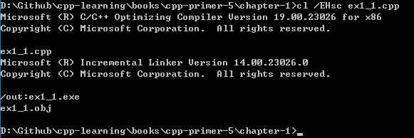

# 第一章  开始

## 练习 1.1  
> 查阅你使用的编译器的文档，确定它所使用的文件命名约定。编译并运行第2页的`main`程序。  

1. 文件命名约定  
* [GCC and File Extensions](http://labor-liber.org/en/gnu-linux/development/extensions)  
* [File Types Created for Visual C++ Projects](https://msdn.microsoft.com/en-us/library/3awe4781.aspx)  

2. 运行`main`程序  
* windows  
  

## 练习 1.2  
> 改写程序，让它返回-1,。返回值-1通常被当作程序错误的标识。重新编译并运行你的程序，观察你的系统如何处理`main`返回的错误标识。  

* Windows  
  

* Linux  
返回**255**，原因查看[这里](http://www.tldp.org/LDP/abs/html/exitcodes.html)。  

## 练习 1.3  
> 编写程序，在标准输出上打印`Hello, World`。  

```cpp
#include <iostream>

int main()
{
    std::cout << "Hello, World" << std::endl;
    return 0;
}
```

## 练习 1.4  
> 我们的程序使用加法运算符+来将两个数相加。编写程序使用乘法运算符*，来打印两个数的积。  

```cpp
#include <iostream>

int main()
{
    std::cout << "Enter two numbers: " << std::endl;
    int v1 = 0, v2 = 0;
    std::cin >> v1 >> v2;
    std::cout << "The product of " << v1 << " and " << v2
              << " is " << v1 * v2 << std::endl;
    return 0;
}
```
> 其实我们在使用乘法时，应该是所有数值操作是，特别要注意数值**越界**的情况  
  

## 练习 1.5
> 我们将所有输出操作放在一条很长的语句中。重写程序，将每个运算对象的打印操作放在一条独立语句中。  

```cpp
 #include <iostream>
 
int main()
{
    std::cout << "Enter two numbers: " << std::endl;
    int v1 = 0, v2 = 0;
    std::cin >> v1 >> v2;
    std::cout << "The sum of ";
    std::cout << v1;
    std::cout << " and ";
    std::cout << v2;
    std::cout << " is ";
    std::cout << v1 + v2;
    std::cout << std::endl; // Don't forget to add "endl" to flush content
}
```

注意最后的`std::endl`，这是一个被称为**操作符（manipulator）**的特殊值。写入`endl`的效果是结束当前行，并将于设备关联的缓冲区（buffer）中的内容刷到设备中。缓冲刷新操作可以保证到目前为止程序所产生的所有输出都真正写入输出流中，而不是仅仅停留在内容中等待写入流。  

## 练习 1.6
> 解释下面程序片段是否合法。  
> ```cpp
> std::cout << "The sum of " << v1;
>           << " and " << v2;
>           << " is " << v1 + v2 << std::endl;
> ```
> 如果程序是合法的，它输出什么？如果程序不合法，原因何在？应该如何修正？  

此程序不合法，在编译阶段会报出错误：  
```
error: expected primary-expression before ‘<<’ token
```
因为在程序没有结束之前有`;`，只需要移除第一行、第二行末尾的逗号就行。


## 引用
1. [C++ 编译&运行时遇到的坎](http://www.jianshu.com/p/cc2b98c27f6c)